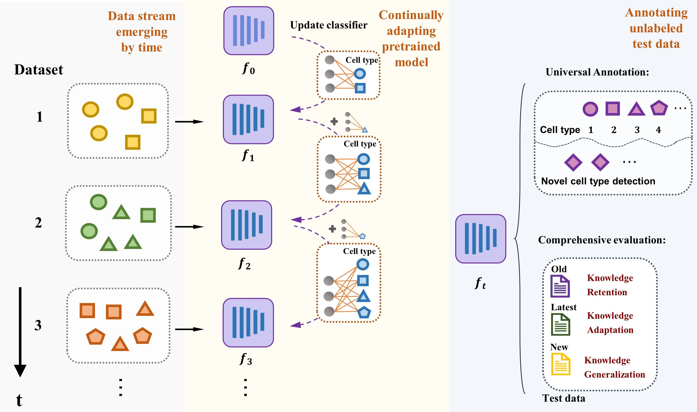

.. inclusion-marker-do-not-remove
CANAL: Continually adapting pre-trained language model to universal annotation of single-cell RNA-seq data
==========================================================================================================

PyTorch implementation of CANAL, a universal cell-type annotation tool
that continuously fine-tunes a pretrained language model trained on a
large amount of unlabeled scRNA-seq data, as new well-labeled data
emerges.

|image|

**To apply the CANAL model**:

   -  **prepare the preprocessed scRNA-seq data**: ``gene_align`` and
      ``normalize`` in the ``preprocess`` module are required to obtain
      AnnData objects for network inputs.
   -  **Run CANAL at the initial stage**: use ``CANAL_model.train`` in
      the ``model`` module by setting ``current_stage=1``. The model is
      initialized by the pre-trained model checkpoint on the Panglao
      dataset
   -  **Run CANAL at the incremental stage**: use ``CANAL_model.train``
      in the ``model`` module by setting ``current_stage``\ ≥1. The
      model is initialized by the model trained at previous stage
   -  **Predict cell types of the test data**: use
      ``CANAL_model.predict`` in the ``model`` module to obtain the
      predicted cell types of the test data
   -  **Evaluate model performance**: If true cell types of the test
      data is available, use ``CANAL_model.evaluation`` in the ``model``
      module to evaluate the performance of current fine-tuned model

There are three examples in the ``Tutorial`` to run CANAL: >- Tutorial
1: *Run CANAL with data stream from various batches* >- Tutorial 2: *Run
CANAL with data stream from different tissues* >- Tutorial 3: *Apply
CANAL on test data with novel cells*

**Hyper-parameters**

   -  ``lambda``: default 0.1, the strength of representation
      distillation loss

   -  ``L``: default 1000, the size of example bank

Data Availability
=================

+-----------------------------------------------------------------------------------------+---------------------------------------------------+
| Link                                                                                    | Description                                       |
+=========================================================================================+===================================================+
| https://drive.google.com/drive/folders/1BMf-N-k-3aCEY7CJvUcK9nZZ2UD7p3C0?usp=sharing    | Datasets of the pancreas experiemnts              |
+-----------------------------------------------------------------------------------------+---------------------------------------------------+
| https://drive.google.com/drive/folders/1CaBySV_EFAPPrlpSevEewFds5cjJxC_T?usp=sharing    | Datasets of the cross-tissue experiemnts          |
+-----------------------------------------------------------------------------------------+---------------------------------------------------+
| https://drive.google.com/drive/folders/1OGMWxR7qTWd_p21d57EyNWv5X48BNN0M?usp=sharing    | Datasets of the human immune experiemnts          |
+-----------------------------------------------------------------------------------------+---------------------------------------------------+

The detailed information about pre-trained model checkpoint and the
Panglao dataset usded for pre-training can be seen at:
https://github.com/TencentAILabHealthcare/scBERT

If you have any questions, please contact: wanhui1997@pku.edu.cn

